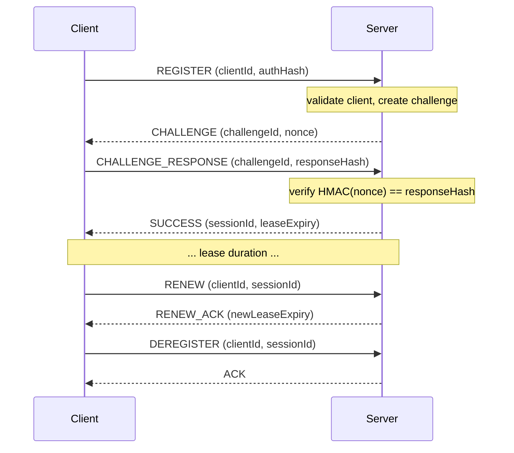

<div align="right">

**English** | **[Tiếng Việt](README.vi.md)**

</div>

# Registration System

A TCP-based client registration and session management system with challenge-response authentication using HMAC-SHA256.

## Table of Contents

- [Build](#build)
- [Configuration](#configuration)
    - [Server](#server)
    - [Client](#client)
- [Run](#run)
    - [Start the server](#start-the-server)
    - [Run load/stress tests](#run-loadstress-tests)
- [Architecture](#architecture)
- [Protocol and Flow](#protocol-and-flow)
    - [Wire Format](#wire-format)
    - [Message Types](#message-types)
    - [Registration Sequence](#registration-sequence)
    - [Authentication](#authentication)
    - [Status Codes](#status-codes)
- [Example Log](#example-log)
- [Common Errors](#common-errors)
- [Retry, Max Retry \& Timeout Design](#retry-max-retry--timeout-design)
- [Performance](#performance)
    - [Stress Test Results](#stress-test-results-10000-clients)

## Build

JDK 17+ and Gradle (via the included wrapper).

```bash
./gradlew build
```

The project has three modules:

| Module   | Path      | Description                                                     |
|----------|-----------|-----------------------------------------------------------------|
| `shared` | `/shared` | Protocol definitions, packet codec, network layer, HMAC utility |
| `server` | `/server` | TCP server, registration/session/lease logic, packet handlers   |
| `client` | `/client` | Client simulator for load and stress testing                    |

## Configuration

Two `.properties` files control the server and client.

### Server

`server/src/main/resources/server.properties`

| Property              | Default         | Description                           |
|-----------------------|-----------------|---------------------------------------|
| `server.port`         | `8000`          | TCP listen port                       |
| `server.max-retry`    | `3`             | Max retry attempts per client         |
| `lease.seconds`       | `60`            | Session lease duration (seconds)      |
| `challenge.seconds`   | `30`            | Challenge timeout (seconds)           |
| `server.client-count` | `300`           | Expected client count (informational) |
| `server.secret`       | `defaultSecret` | Default client secret for auth        |

### Client

`client/src/main/resources/client.properties`

| Property                    | Default         | Description                              |
|-----------------------------|-----------------|------------------------------------------|
| `server.port`               | `8000`          | Server port                              |
| `client.numbers`            | `10000`         | Number of simulated clients              |
| `client.rps`                | `2`             | Requests per second (load test mode)     |
| `client.time-left-to-renew` | `10`            | Seconds before expiry to attempt renewal |
| `client.max-retry`          | `3`             | Max retry attempts                       |
| `client.secret`             | `defaultSecret` | Shared secret for HMAC                   |
| `lease.seconds`             | `60`            | Must match server value                  |

## Run

### Start the server

```bash
./gradlew :server:run
```

The server logs to `logs/server.log` (no console output by default).

### Run load/stress tests

```bash
./gradlew :server:test --tests "org.lhduc.registration.server.LoadTestRunner"
```

`LoadTestRunner` runs 6 scenarios: 3 stress (100/500/1000 concurrent clients) and 3 load (100/500/1000 clients at
10/50/100 rps). Each scenario uses a deterministic, non-overlapping ID range. Reports are printed to stdout and logged.

## Architecture

```
Main → Server (TCP accept loop)
         ├─ PacketDispatcher → RegisterHandler / ChallengeResponseHandler / RenewHandler / DeregisterHandler
         │                          └─ RegistrationService → 3 in-memory repositories
         └─ SessionExpirySweeper (cleanup every 5s)
```

The **shared** module provides **PacketCodec** (binary serialize/deserialize), **Connection** (Socket wrapper), *
*HmacUtil** (HMAC-SHA256), and all **Packet** types.

The **server** processes each client in a single thread (one connection, multiple packets). Inbound packets are
dispatched to typed handlers. Session expiry and challenge cleanup run on a scheduled timer.

## Protocol and Flow

### Wire Format

Every packet has a fixed-length header on the wire:

```
[length:4][version:4][type:4][requestId:16][timestamp:8] + [payload...]
```

All integers are **big-endian** (network byte order). `requestId` is a UUID (16 bytes). `timestamp` is epoch
milliseconds as a 64-bit signed integer. The payload format depends on the message type.

### Message Types

| Type                     | Direction       | Payload                                                        |
|--------------------------|-----------------|----------------------------------------------------------------|
| `REGISTER` (0)           | Client → Server | clientId (string), authHash (32 bytes)                         |
| `CHALLENGE` (1)          | Server → Client | challengeId (UUID), nonce (32 bytes), timeout (long ms)        |
| `CHALLENGE_RESPONSE` (2) | Client → Server | clientId (string), challengeId (UUID), responseHash (32 bytes) |
| `RENEW` (3)              | Client → Server | clientId (string), sessionId (UUID)                            |
| `RENEW_ACK` (4)          | Server → Client | statusCode (int), newLeaseExpiry (Instant)                     |
| `SUCCESS` (5)            | Server → Client | sessionId (UUID), leaseExpiry (Instant)                        |
| `DEREGISTER` (6)         | Client → Server | clientId (string), sessionId (UUID)                            |
| `ACK` (7)                | Server → Client | (no payload)                                                   |
| `ERROR` (-1)             | Server → Client | statusCode (int), message (string)                             |

### Registration Sequence



### Authentication

1. Client sends `authHash = HMAC-SHA256(secret, clientId)` with REGISTER.
2. Server does **not** verify at REGISTER time - it always responds with CHALLENGE.
3. Client computes `responseHash = HMAC-SHA256(secret, nonce)` and sends it in CHALLENGE_RESPONSE.
4. Server verifies `HMAC-SHA256(secret, nonce) == responseHash`. On mismatch, ERROR is returned.

This proves the client knows the shared secret without sending it in plaintext.

### Status Codes

| Code                | Value | Meaning                        |
|---------------------|-------|--------------------------------|
| `SUCCESS`           | 0     | Operation succeeded            |
| `UNAUTHORIZED`      | 1     | Invalid clientId or session    |
| `LEASE_EXPIRED`     | 2     | Session lease has expired      |
| `INVALID_CHALLENGE` | 3     | Challenge not found or expired |
| `TIMEOUT`           | 4     | Operation timed out            |
| `RETRY_LIMIT`       | 5     | Max retries exceeded           |
| `SERVER_ERROR`      | 6     | Internal server error          |

## Example Log

Server log entries (written to `logs/server.log` by the FILE appender):

```
2025-07-30 22:35:44.123 INFO  [main] o.l.registration.Main - Server config loaded: port=9998, lease=60s, challenge=5s, clients=0
2025-07-30 22:35:44.321 INFO  [main] o.l.registration.server.SessionExpirySweeper - Session expiry sweeper started (interval=PT5S)
2025-07-30 22:35:44.456 INFO  [main] o.l.registration.server.Server - Server listening on port 9998
2025-07-30 22:35:45.012 INFO  [pool-2-thread-1] o.l.registration.server.Server - New connection from /127.0.0.1:54321
2025-07-30 22:35:45.089 INFO  [pool-2-thread-1] o.l.registration.handler.RegisterHandler - Sent challenge 550e8400-e29b-41d4-a716-446655440000 to client 00000000-0000-0000-0000-000000000001
2025-07-30 22:35:45.156 INFO  [pool-2-thread-2] o.l.registration.handler.ChallengeResponseHandler - Client 00000000-0000-0000-0000-0000000001a6 registered, session b5629f3f-...
2025-07-30 22:35:45.201 INFO  [session-expiry-sweeper] o.l.registration.service.RegistrationService - Cleaned 150 expired/used challenges
2025-07-30 22:35:55.432 INFO  [pool-2-thread-1] o.l.registration.handler.RenewHandler - Client 00000000-... renewed, lease expiry 22:36:55.432...
2025-07-30 22:36:00.101 INFO  [pool-2-thread-1] o.l.registration.handler.DeregisterHandler - Client 00000000-... deregistered
2025-07-30 22:36:00.203 INFO  [session-expiry-sweeper] o.l.registration.service.RegistrationService - Expired 5 sessions
```

Client logs:

```
2026-07-30 18:09:04.097 WARN  [pool-1-thread-6453] org.l.registration.client.ClientService
                - Client 00000000-0000-0000-0000-0000000021c6 attempt 3/3 failed: Connection refused: connect
2026-07-30 18:09:04.125 INFO  [main] org.l.registration.client.ClientSimulator
                - All done: 1000 succeeded, 0 failed
2026-07-30 18:09:05.533 INFO  [main] org.l.registration.client.ClientSimulator
===== STRESS TEST REPORT =====
Simulated clients:                  1000
Configured rate:                    1000 rps
Actual throughput:                  211.5 rps
Total registration procedures:      1000
Successful registrations:           1000
Failed registrations:               0
Timeout requests:                   0
Retries:                            0
Response time avg / min / max:      2.9 / 0.8 / 42.1 ms
Registration success rate:          100.0%
Total run time:                     4727 ms
==================================
```

## Common Errors

| Symptom                                  | Likely Cause                                     |
|------------------------------------------|--------------------------------------------------|
| `Missing required property: server.port` | Missing/deleted `server.properties`              |
| `Address already in use`                 | Port already occupied                            |
| `Invalid or expired challenge`           | Client took too long to respond to CHALLENGE     |
| `Client already registered`              | Client re-registers without deregistering first  |
| `Authentication failed`                  | Secret mismatch between client and server        |
| `SessionId mismatch`                     | Client provided wrong sessionId for deregister   |
| `No active session for client`           | Session expired or never created                 |
| `Clients not found / ID collision`       | Multiple test scenarios ran with overlapping IDs |

## Retry, Max Retry & Timeout Design

Each client retries up to `maxRetry` times (default: **3**) with a linear backoff of **5s × attempt_number** between
attempts (5s, 10s, ...). If all attempts fail, registration is abandoned with an exception.

A single TCP `Socket` has a **10s read timeout** set via `socket.setSoTimeout(10000)`. If the server doesn't respond
within that window, a `SocketTimeoutException` triggers a retry.

The server enforces a **challenge timeout** (default: **30s**). If the client doesn't respond with `CHALLENGE_RESPONSE`
before the challenge expires, the challenge becomes invalid and the client must start over with a new `REGISTER`.

Session leases (default: **60s**) are checked on `RENEW` - expired leases are rejected. A background
`SessionExpirySweeper` (every **5s**) evicts expired sessions and used/expired challenges from memory.

## Performance

Measured with VisualVM during stress tests with:

- 10000 concurrent clients
- **backlog=50**

| Metric          | Value  |
|-----------------|--------|
| CPU max spike   | 5.6%   |
| Heap memory min | 15 MB  |
| Heap memory max | 150 MB |

### Stress Test Results (10000 clients)

| Run | Procedures | Success | Fail | Timeout | Retries | Avg / Min / Max (ms) | Rate  | Time    |
|-----|------------|---------|------|---------|---------|----------------------|-------|---------|
| 1   | 24879      | 7568    | 2432 | 0       | 14879   | 322.8 / 1.1 / 2936.2 | 75.7% | 20646ms |
| 2   | 25657      | 4789    | 5211 | 0       | 15657   | 662.5 / 1.2 / 3074.1 | 47.9% | 22252ms |
| 3   | 25358      | 9976    | 24   | 0       | 15358   | 88.2 / 0.9 / 2027.3  | 99.8% | 20140ms |
| 4   | 23738      | 5215    | 4785 | 0       | 13738   | 104.6 / 1.1 / 1259.8 | 52.2% | 17868ms |
| 5   | 23677      | 8272    | 1728 | 0       | 13677   | 39.8 / 1.0 / 631.4   | 82.7% | 17590ms |
