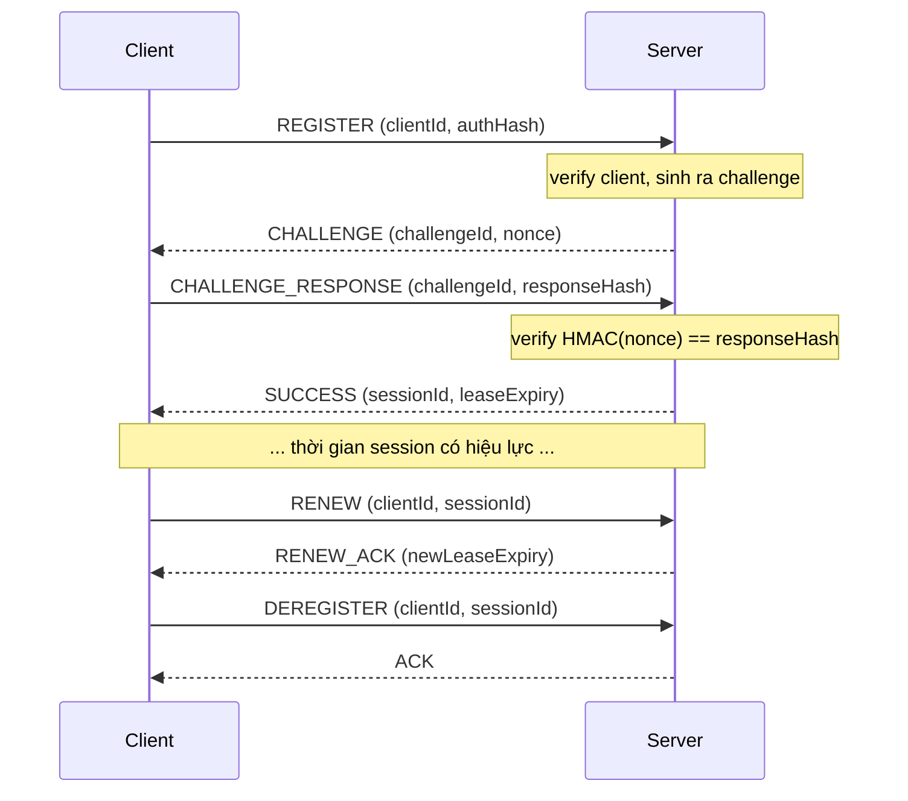

<div align="right">

**[English](README.md)** | **Tiếng Việt**

</div>

# Hệ thống đăng ký Client/Server

Hệ thống đăng ký và quản lý phiên (session) qua giao thức TCP với cơ chế xác thực challenge-response sử dụng thuật toán HMAC-SHA256.

## Mục lục

- [Build](#build)
- [Config](#config)
  - [Server](#server)
  - [Client](#client)
- [Run](#run)
  - [Khởi động Server](#khởi-động-server)
  - [Chạy load test / stress test](#chạy-load-test--stress-test)
- [Kiến trúc](#kiến-trúc)
- [Giao thức và luồng](#giao-thức-và-luồng)
  - [Định dạng dữ liệu](#định-dạng-dữ-liệu)
  - [Các loại Message](#các-loại-message)
  - [Luồng thực thi](#luồng-thực-thi)
  - [Cơ chế xác thực](#cơ-chế-xác-thực)
  - [Status Codes](#status-codes)
- [Ví dụ Log](#ví-dụ-log-sample-logs)
- [Các lỗi thường gặp](#các-lỗi-thường-gặp)
- [Timeout & Retry](#timeout--retry)
- [Hiệu năng](#hiệu-năng)
  - [Kết quả Stress Test](#kết-quả-stress-test-10000-client-2-rps)

## Build

Yêu cầu JDK 17+ và Gradle (có thể sử dụng wrapper đi kèm).

```bash
./gradlew build

```

Dự án gồm ba module chính:

| Module | Đường dẫn | Mô tả |
| --- | --- | --- |
| `shared` | `/shared` | Định nghĩa giao thức, binary serialization (encode/decode packet), tầng network, utility HMAC |
| `server` | `/server` | TCP server, xử lý đăng ký/session/session lease (thời gian hiệu lực), packet dispatcher |
| `client` | `/client` | Client giả lập (simulator) để thực hiện load test và stress test |

## Config

Có hai file `.properties` dùng để config server và client.

### Server

`server/src/main/resources/server.properties`

| Thuộc tính | Mặc định | Mô tả |
| --- | --- | --- |
| `server.port` | `8000` | Port TCP lắng nghe |
| `server.max-retry` | `3` | Số lần retry tối đa |
| `lease.seconds` | `60` | Thời gian sống của session (giây) |
| `challenge.seconds` | `30` | Timeout của challenge (giây) |
| `server.client-count` | `300` | Số lượng client dự kiến |
| `server.secret` | `defaultSecret` | Secret key mặc định cho xác thực |

### Client

`client/src/main/resources/client.properties`

| Thuộc tính | Mặc định | Mô tả |
| --- | --- | --- |
| `server.port` | `8000` | Port của server |
| `client.numbers` | `10000` | Số lượng client cần giả lập |
| `client.rps` | `2` | Số request mỗi giây (chế độ load test) |
| `client.time-left-to-renew` | `10` | Thời gian (giây) còn lại trước khi hết hạn để thực hiện renew |
| `client.max-retry` | `3` | Số lần retry tối đa |
| `client.secret` | `defaultSecret` | Secret key dùng chung để tính toán HMAC |
| `lease.seconds` | `60` | Phải khớp với giá trị của server |

## Run

### Khởi động Server

```bash
./gradlew :server:run

```

Server ghi log vào file `logs/server.log` (mặc định tắt log output ở console).

### Chạy load test / stress test

```bash
./gradlew :server:test --tests "org.lhduc.registration.server.LoadTestRunner"

```

`LoadTestRunner` sẽ chạy 6 kịch bản: 3 kịch bản stress test (100/500/1000 client đồng thời) và 3 kịch bản load test (100/500/1000 client với tốc độ 10/50/100 RPS). Mỗi kịch bản sử dụng một dải ID xác định, không bị trùng lặp (overlap). Report sẽ được in ra `stdout` và ghi vào file log.

## Kiến Trúc

```
Main → Server (TCP accept loop)
         ├─ PacketDispatcher → RegisterHandler / ChallengeResponseHandler / RenewHandler / DeregisterHandler
         │                          └─ RegistrationService → 3 repositories (in-memory)
         └─ SessionExpirySweeper (tiến trình dọn dẹp chạy định kỳ mỗi 5s)

```

Module **shared** cung cấp **PacketCodec** (xử lý binary serialization), **Connection** (wrapper cho Socket), **HmacUtil** (thuật toán HMAC-SHA256), và các class định nghĩa **Packet**.

Module **server** xử lý mỗi client trên một luồng (thread) riêng biệt theo mô hình thread-per-connection (một kết nối có thể xử lý nhiều packet). Các packet nhận được sẽ được điều phối tới các handler tương ứng dựa trên loại packet. Tiến trình dọn dẹp các session và challenge hết hạn được thực thi bởi một timer định kỳ.

## Giao thức và luồng

### Định dạng dữ liệu

Mỗi packet truyền trên mạng bao gồm một header có độ dài cố định:

```
[length:4][version:4][type:4][requestId:16][timestamp:8] + [payload...]

```

Tất cả các số nguyên đều được mã hóa ở định dạng **big-endian** (network byte order). `requestId` là UUID (16 byte). `timestamp` là số mili giây tính từ Unix Epoch, được biểu diễn bằng số nguyên có dấu 64-bit. Định dạng của phần `payload` sẽ phụ thuộc vào loại message.

### Các loại Message

| Loại | Hướng | Payload |
| --- | --- | --- |
| `REGISTER` (0) | Client → Server | clientId (chuỗi), authHash (32 byte) |
| `CHALLENGE` (1) | Server → Client | challengeId (UUID), nonce (32 byte), timeout (long ms) |
| `CHALLENGE_RESPONSE` (2) | Client → Server | clientId (chuỗi), challengeId (UUID), responseHash (32 byte) |
| `RENEW` (3) | Client → Server | clientId (chuỗi), sessionId (UUID) |
| `RENEW_ACK` (4) | Server → Client | statusCode (int), newLeaseExpiry (Instant) |
| `SUCCESS` (5) | Server → Client | sessionId (UUID), leaseExpiry (Instant) |
| `DEREGISTER` (6) | Client → Server | clientId (chuỗi), sessionId (UUID) |
| `ACK` (7) | Server → Client | (không có payload) |
| `ERROR` (-1) | Server → Client | statusCode (int), message (chuỗi) |

### Luồng thực thi



### Cơ chế xác thực

1. Client đính kèm `authHash = HMAC-SHA256(secret_key, clientId)` khi gửi packet REGISTER.
2. Server **không** xác thực thông tin này ngay tại bước REGISTER - mà luôn phản hồi bằng một packet CHALLENGE.
3. Client tính toán `responseHash = HMAC-SHA256(secret_key, nonce)` và gửi lên thông qua CHALLENGE_RESPONSE.
4. Server xác minh `HMAC-SHA256(secret_key, nonce) == responseHash`. Nếu không khớp, trả về packet ERROR.

Cơ chế này giúp chứng minh client đang nắm giữ secret key hợp lệ mà không cần truyền trực tiếp key đó dưới dạng văn bản thuần (plaintext) qua mạng.

### Status Codes

| Mã | Giá trị | Ý nghĩa |
| --- | --- | --- |
| `SUCCESS` | 0 | Xử lý thành công |
| `UNAUTHORIZED` | 1 | clientId hoặc session không hợp lệ |
| `LEASE_EXPIRED` | 2 | Session lease đã hết hạn |
| `INVALID_CHALLENGE` | 3 | Challenge không tồn tại hoặc đã hết hạn |
| `TIMEOUT` | 4 | Request bị timeout |
| `RETRY_LIMIT` | 5 | Vượt quá số lần retry tối đa |
| `SERVER_ERROR` | 6 | Lỗi internal server |

## Ví Dụ Log (Sample Logs)

Log của server (được ghi vào `logs/server.log` thông qua FILE appender):

```
2025-07-30 22:35:44.123 INFO  [main] o.l.registration.Main - Server config loaded: port=9998, lease=60s, challenge=5s, clients=0
2025-07-30 22:35:44.321 INFO  [main] o.l.registration.server.SessionExpirySweeper - Session expiry sweeper started (interval=PT5S)
2025-07-30 22:35:44.456 INFO  [main] o.l.registration.server.Server - Server listening on port 9998
2025-07-30 22:35:45.012 INFO  [pool-2-thread-1] o.l.registration.server.Server - New connection from /127.0.0.1:54321
2025-07-30 22:35:45.089 INFO  [pool-2-thread-1] o.l.registration.handler.RegisterHandler - Sent challenge 550e8400-e29b-41d4-a716-446655440000 to client 00000000-0000-0000-0000-000000000001
2025-07-30 22:35:45.156 INFO  [pool-2-thread-2] o.l.registration.handler.ChallengeResponseHandler - Client 00000000-0000-0000-0000-0000000001a6 registered, session b5629f3f-...
2025-07-30 22:35:45.201 INFO  [session-expiry-sweeper] o.l.registration.service.RegistrationService - Cleaned 150 expired/used challenges
2025-07-30 22:35:55.432 INFO  [pool-2-thread-1] o.l.registration.handler.RenewHandler - Client 00000000-... renewed, lease expiry 22:36:55.432...
2025-07-30 22:36:00.101 INFO  [pool-2-thread-1] o.l.registration.handler.DeregisterHandler - Client 00000000-... deregistered
2025-07-30 22:36:00.203 INFO  [session-expiry-sweeper] o.l.registration.service.RegistrationService - Expired 5 sessions
```

Client logs: 

```
2026-07-30 18:09:04.097 WARN  [pool-1-thread-6453] org.l.registration.client.ClientService
                - Client 00000000-0000-0000-0000-0000000021c6 attempt 3/3 failed: Connection refused: connect
2026-07-30 18:09:04.125 INFO  [main] org.l.registration.client.ClientSimulator
                - All done: 1000 succeeded, 0 failed
2026-07-30 18:09:05.533 INFO  [main] org.l.registration.client.ClientSimulator
===== STRESS TEST REPORT =====
Simulated clients:                  1000
Configured rate:                    1000 rps
Actual throughput:                  211.5 rps
Total registration procedures:      1000
Successful registrations:           1000
Failed registrations:               0
Timeout requests:                   0
Retries:                            0
Response time avg / min / max:      2.9 / 0.8 / 42.1 ms
Registration success rate:          100.0%
Total run time:                     4727 ms
==================================
```

## Các lỗi thường gặp

| Lỗi                                      | Nguyên nhân                                                     |
|------------------------------------------|-----------------------------------------------------------------|
| `Missing required property: server.port` | Bị thiếu hoặc cấu hình sai file `server.properties`             |
| `Address already in use`                 | Port đã bị một tiến trình khác chiếm dụng                       |
| `Invalid or expired challenge`           | Client phản hồi CHALLENGE quá chậm (timeout)                    |
| `Client already registered`              | Client đăng ký mới nhưng chưa hủy đăng ký (deregister) phiên cũ |
| `Authentication failed`                  | Secret key cấu hình giữa client và server không khớp            |
| `SessionId mismatch`                     | Client gửi sai `sessionId` khi thực hiện deregister             |
| `No active session for client`           | Session đã hết hạn hoặc chưa khởi tạo thành công                |
| `Clients not found / ID collision`       | Chạy nhiều kịch bản test sử dụng chung một dải ID               |

## Timeout & Retry

Mỗi client sẽ thực hiện retry tối đa `maxRetry` lần (mặc định: **3**) với cơ chế **linear backoff** (thời gian chờ tính bằng `5s × số lần retry`) giữa các lần gửi (5s, 10s, ...). Nếu vẫn thất bại sau khi hết số lượt retry, quá trình đăng ký sẽ bị hủy bỏ (abort) và ném ra exception.

Tại tầng mạng, một object `Socket` TCP được cấu hình **read timeout là 10s** (`socket.setSoTimeout(10000)`). Nếu server không phản hồi trong khoảng thời gian này, `SocketTimeoutException` sẽ được ném ra và trigger một lần retry.

Phía server áp dụng cơ chế **challenge timeout** (mặc định: **30s**). Nếu server không nhận được `CHALLENGE_RESPONSE` từ client trước thời gian này, challenge sẽ bị vô hiệu hóa, và client buộc phải gọi lại luồng `REGISTER` từ đầu.

Session lease (mặc định: **60s**) được kiểm tra khi `RENEW` - lease hết hạn bị từ chối. Tiến trình nền `SessionExpirySweeper` (mỗi **5s**) xóa các session hết hạn và challenge đã dùng/hết hạn khỏi bộ nhớ.

## Hiệu năng

Đo bằng VisualVM trong stress test với
- 10000 client đồng thời
- **backlog=50**

| Chỉ số | Giá trị |
| --- | --- |
| CPU đỉnh | 5.6% |
| Heap memory tối thiểu | 15 MB |
| Heap memory tối đa | 150 MB |

### Kết quả Stress Test (10.000 client, 2 rps)

| Lần | Tổng request | Thành công | Thất bại | Timeout | Retry | Avg / Min / Max (ms) | Tỉ lệ thành công | Thời gian chạy |
| --- | --- | --- | --- | --- | --- | --- | --- | --- |
| 1 | 24879 | 7568 | 2432 | 0 | 14879 | 322.8 / 1.1 / 2936.2 | 75.7% | 20646ms |
| 2 | 25657 | 4789 | 5211 | 0 | 15657 | 662.5 / 1.2 / 3074.1 | 47.9% | 22252ms |
| 3 | 25358 | 9976 | 24 | 0 | 15358 | 88.2 / 0.9 / 2027.3 | 99.8% | 20140ms |
| 4 | 23738 | 5215 | 4785 | 0 | 13738 | 104.6 / 1.1 / 1259.8 | 52.2% | 17868ms |
| 5 | 23677 | 8272 | 1728 | 0 | 13677 | 39.8 / 1.0 / 631.4 | 82.7% | 17590ms |